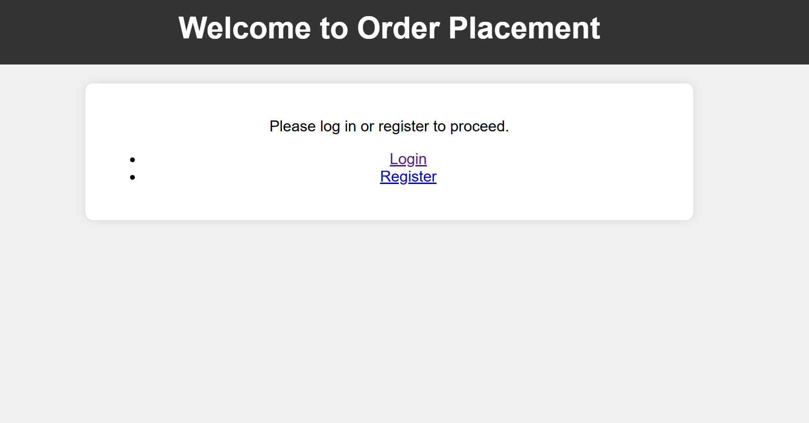

# Savannah Informatics Technical Interview
This is a break down on the various reqiorements for the Technical assignment on the Technical Support Engineer role.

This is a simple customer order placement and management application where customers can enter items to place orders on. The application has been built using Python/Django, containerized with Docker, uses a PostgreSQL database and uses Prometheus and Grafana for monitoring.

## Key Features
- User Authentication and Authorization: 
- Data Validation: Using csrf tokens and cookie management to prevent to prevent XSS attacks, WAF to prevent DDos attacks and form validation for Business Logic attacks.
- SMS Notifications: Sends SMS notifications with the user's email, order number and amount when an order is added, using Africa's Talking API.
- Database: Uses PostgreSQL running on a Docker container and deployed using docker-compose running on the same network as the web apis and monitoring tools.
- Scalability: Deployed on an AWS instance, with a load balancer and an auto scaling group for efficient scaling.
- Continuous Deployment: Using GitHub actions to automate deployment once tests are passed.
- Infrastructure Orchestration: Using Terraform to automate resource provisioning and ensuring the processes can be replicated.
- Monitoring and Evaluation: Using Prometheus and Grafana for monitoring to ensure easier user metric monitoring.

## Prerequisites
- Python/Django
- Docker
- An AWS Account
- PostgreSQL database
- Terraform
- Prometheus and Grafana
- Africa's Talking API credentials for SMS notifications

1. ### Development

I used Django to create REST APIs for simple user operations.

2. ### Testing
I run tests for all created APIs and models to ensure they behave as expected. Integration tests were also performed to ensure users can conduct all activities as intended. 

```sh
python manage.py test core.test -v 2

```


3. ### Dockerizing the application, its database and monitoring tools
I built containers for the web, PostgreSQL database, Prometheus and Grafana. I added them to the same network to ensure they can communicate.  


```sh
docker-compose up --build

```


<br>

4. ### Setting up Terraform for Infrastructure Orchestration

I used Terraform to set up my AWS resources to ensure easier automation and convenient replication and scalability for every deployment. The resources are defined on the main.tf file.

 **Initialize Terraform**: 
   - Before I can applied my configuration, I initialized Terraform in my working directory.

  ```sh
    terraform init
  ```

 **Previewing Changes**: 
  - I previews the changes Terraform will make to my infrastructure 

  ```sh
    terraform plan
  ```  

 **Applying the Terraform Configuration**: 
   - After previewing the resources and ensuring they are configured correctly, I provisioned the resources

  ```sh
    terraform apply
  ```  
  
5. ### Deployed the application on an EC2 Instance

The application is containerized, and deployed on AWS ECS using the EC2 deployment type. 


6. ### Monitoring the deployment using Prometheus and Grafana
  - Monitoring the deployment and visualizing various metrics with Prometheus and Grafana ensures the Operations team can right-size the resources as needed.
   
  - Prometheus captures all platform metrics and sends them to Grafana.

  

  <br>

  - Grafana models the results making it easier to understand and use to make decisions

  


6. Configured SMS Notifications
I Set up Africa's Talking API and configured my application to use these credentials for sending SMS notifications highlighting key details on their order.

SMS Sent to customer after order creation containing their email address, order number and the amount due/paid based on the status of their order.
</br>


7. Configured CI/CD Pipeline with Jenkins
I set up a Jenkins container to run a CI/CD pipeline. This ensured any updates made to the main repository are automatically deployed to the application


## User Navigation through Platform
Login Page
-   For the login page, the user joins with their registered email address and a customer code they used for registration.


Simple Homepage
-   The homepage contains a registration and login page, to ensure users only have access to order data after they have logged in.



User registration Page
-   The registration page takes useer's unique email, customer code and a phone number that will be contacted once an order is placed.


User Order History Page
-   Once a user makes an order, they are saved to their order history page. Here, they can view all the orders they have made, listed on recency. 


Add Order Page
-   A user can add an Order, and it is listed on their history page.


Deleting Orders
-   Users can delete their orders whenever they want to, and they will be notified of a deletion. 


Notification on Successful Order Placement
-   Once the order is placed, the user receives a notification through Africa's Talking. 


## Replicating Project. 
Since all components of the project are containeerized, you can easily test it on your system. Here is a guide on testing the project locally. 

1. ### Cloning the repository
First, clone the repository by running
```sh
git clone https://github.com/Tonny-Kioko/Savannah_Informatics_Assessment.git
```
2. ### Running the deployment
Once cloned, the docker-compose file will be available at the root of the directory. Run the application:
```sh
docker-compose up --build
```

## Conclusion

This is an end-to-end application, covering the entire CI/CD pipeline, using Jenkins, Docker, Prometheus, Grafana among others. It offers a great learning o,opportunity on DevOps practices, monitoring and evaluation, API integration among others.  